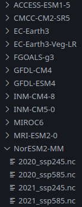

# Climate Change and Thermal Stress in Cattle: Global Projections with High Temporal Resolution

M. Neira, P. Georgiades, Y. Proestos, T. Economou, J. Araya, S Malas, M. Omirou, D. Sparaggis, G. Hadjipavlou, J. Lelieveld

**Correspondence:** Pantelis Georgiades (p.georgiades@cyi.ac.cy) Marco Neira (m.neira@cyi.ac.cy)

## Abstract
Cattle farming, a critical agricultural activity, faces economic losses due to heat stress influenced by temperature and humidity. Using the Temperature-Humidity Index (THI) as a non-invasive measure, we analyzed a novel global dataset with hourly THI projections through the century's end. We evaluated the duration and intensity of thermal stress periods and waves under various greenhouse gas emission scenarios, mapping these projections against current cattle distribution data. Our findings indicate that severe heat stress will significantly challenge future cattle farming, with the Americas, Africa, and South-East Asia projected to experience the most substantial increases in thermal stress conditions, highlighting areas where targeted adaptation strategies will be necessary.

## Instructions

### Environment

Create a new environment and install the following dependencies:

1. cdsapi
2. 

### Data

**ERA5 hourly data on single levels from 1940 to present**

For the historical period, the 2m temperature and 2m dewpoint temperature global ERA5 reanalysis datasets are needed for the period that spans 1990-2019. To download the data, run the src/download_ERA.py script as follows:

```python
python src/downloadERA.py --path=<insert target directory here>
```

**Hourly THI projections**

The data utilized in this study are available under a Creative Commons Attribution 4.0 International (CC BY 4.0) license through the WDC-Climate platform. 

**Data Citation:** Georgiades, Pantelis (2024). Temperature Humidity Index GDDP-NEX-CMIP6 ML projections. World Data Center for Climate (WDCC) at DKRZ. https://doi.org/10.26050/WDCC/THI

**Instructions**

1. Download the THI hourly predictions data from https://doi.org/10.26050/WDCC/THI.
2. Create a directory for each model and download the hourly THI data for the two scenarios to it's respective directory, like shown below.

<p align="center">
  
</p>

**Global cattle distribution**

The global cattle distribution data used in this study is decribed and freely distributed in Gilbert, M., Nicolas, G., Cinardi, G., Van Boeckel, T. P., Vanwambeke, S. O., Wint,535
G., & Robinson, T. P. (2018). Global distribution data for cattle, buffaloes,536
horses, sheep, goats, pigs, chickens and ducks in 2010. Scientific data, 5 (1), 1–11.

### Data analysis procedures

**Hours Above Threshold**

To calculate the hours above the two THI thresholds (68.8 and 84) per day/grid cell, the *hrs_above_thr_analysis.py* script is used as follows:

```python
python src/hrs_above_thr_analysis.py \
  --pathTHI=<Path to directory where hourly THI proections are stored> \
  --pathTarget=<Path to directory where the analysed data will be stored> \
  --pathERA=<Path to ERA5 data directory.> \
  --scenario=<ssp245 or ssp585> \
  --threshold=<68.8 or 84>
```

The previous script will generate yearly netcdf files for each scenario/year/model combination with the total number of hours above the threshold for each day. To combine them in a yearly dataset the *src/hrs_above_yearly_averages.py* script is used, as:

```python
python src/hrs_above_yearly_averages.py \
  --pathDat=<Path to where the daily total number of hours above the threshold datasets are stored.>
```

**At least one hour above the threshold per day**

To calculate the number of days per grid cell per year that there is at least one hour above the specified THI threshold, the *src/at_least_1hr.py* and *src/at_least_1hr_ERA.py* scripts are used. These scripts use the same output from the previous analysis, so make sure to have created these first before running these two scripts:

```python

```